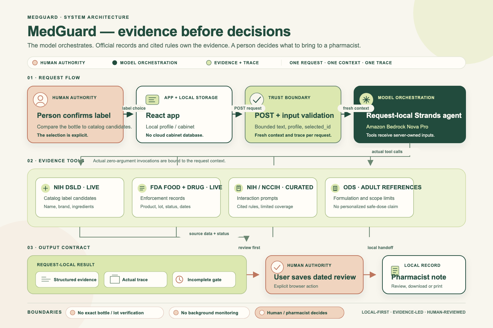
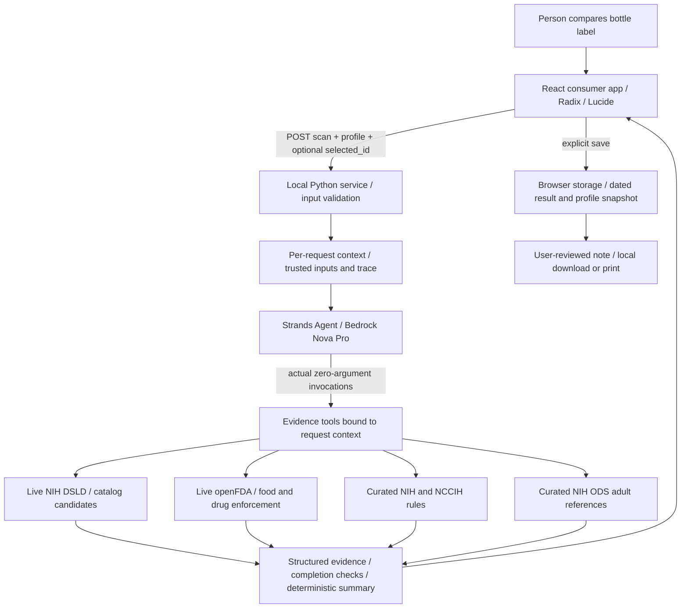

# MedGuard architecture

**The model orchestrates; official records and cited rules own the evidence; the human decides.** An official source does not make a text search an exact bottle match.

[Editable SVG](docs/media/medguard-architecture.svg)

## Two requests, one human boundary

1. **Lookup:** the model invokes only `identify_supplement`. Live candidates return with `needs_confirmation`. There is no recall/interaction/dosage conclusion or automatic cabinet insertion.
2. **Confirmed review:** the chosen `selected_id` must still occur in fresh results for the original query. A fresh Strands instance invokes identification, recall, interactions and dosage. Tools close over server-owned inputs; the model cannot replace ingredients or profile data with arguments.

Each request has its own trace, evidence and model instance. Missing, blocked or failed tools yield `incomplete`; loose-pill descriptions yield `unidentified`. A full workflow yields `complete`, meaning the bounded checks completed, not that a product is safe. Structured evidence generates the displayed summary; unrestricted model prose cannot become a safety verdict.

## Source semantics

`medguard_data.py` owns live requests and curated matching. `core-chain.py` imports the same functions for public-data inspection without AWS or Strands.

DSLD provides catalog label information, not product authenticity. FDA searches use quoted phrases, preserve product/lot/status metadata and distinguish no-match from source failure. Both food and drug enforcement are searched. Curated rules use whole-token matching and are not a clinical knowledge graph. Adult reference limits cannot establish intake without amounts, servings, other sources and clinical context.

## Trust and privacy boundaries

- Browser → local server: validated bounded product text, medicines/conditions arrays and optional candidate ID.
- Server → NIH/FDA: product query over HTTPS, without health-profile data in URLs.
- Service → Bedrock: orchestration and tool outputs, including matched medication/condition terms. Credentials remain outside the repository.
- Responses: safe error messages omit provider internals and health input; failures stay incomplete.
- Local storage: user-controlled dated reviews, not encrypted cloud medical records. Changed profiles require rechecks.
- Export: generated locally, reviewed by the user, never automatically sent.

The service binds to `127.0.0.1`; Vite proxies `/api`. There is no production authentication, public hosting, cloud persistence or scheduler. Public deployment needs a separate access/privacy design.

See [API contract](docs/API.md), [baseline evaluation](EVALUATION.md), and [design](DESIGN.md).
